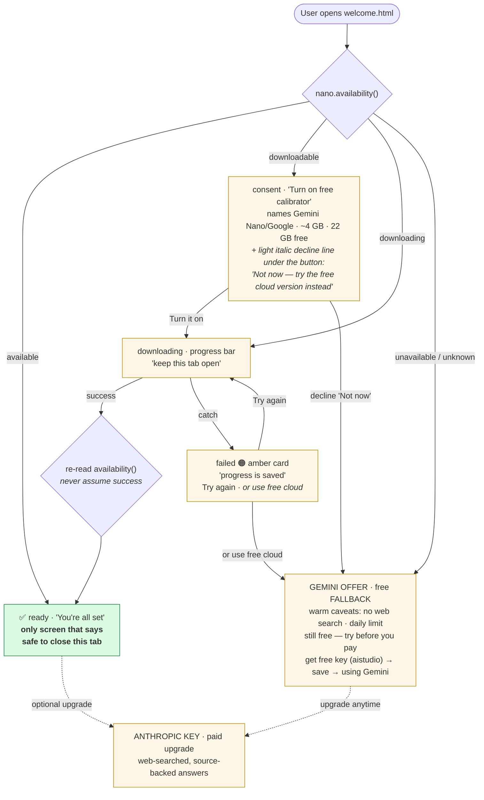
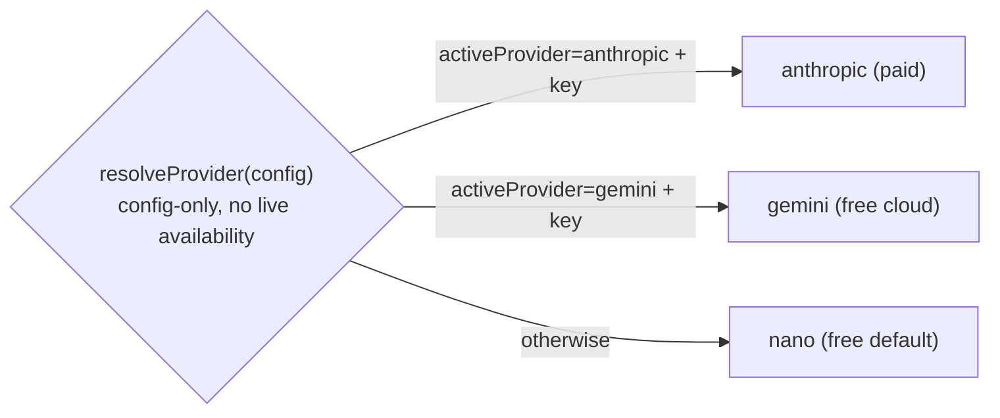
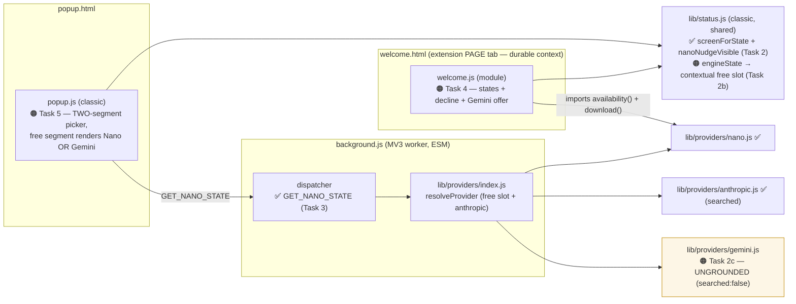

# Piece ④ — living diagram (PROVISIONAL, updated 2026-07-20)

> Working memory, not documentation. Expect this to be wrong in places and to change
> at every wrap. Green = built & verified · amber = planned · red = blocked.

**2026-07-20 — the Gemini blocker is RESOLVED.** A real free-tier `AQ.` key (Google
migrated key format: `AIza` → `AQ.` "auth keys" — the July `AQ.` "confound" was a red
herring; that was already a normal key) proved: free-tier **grounding is genuinely
unavailable** (pricing page: "Not available" on every model; live call → `429` on the
`google_search` tool while plain calls 200). BUT **ungrounded** free Gemini works and, on
15 of the 22 calibration fixtures, **beat the Nano baseline** (structural 99% vs 97%,
directional 87% vs 82%). So Gemini stays IN ④ — as an **ungrounded free FALLBACK to Nano**,
not a flat peer, and not a searched tier. Web search remains the paid (Anthropic) upgrade.

## 1. What the user sees (sequenced onboarding — Nano first, Gemini only as fallback)

**Sequencing rule (load-bearing):** a user never sees Nano and Gemini as a *choice*. Nano is
tried first; Gemini is surfaced **only** when Nano is declined, fails, or is unavailable. If
Nano works, Gemini never appears. `failed` is still a *screen*, not an `availability()` state.

## 1b. Which free engine is "active" (contextual free slot)

**activeProvider is the source of truth** (set at onboarding time — we only select `'gemini'`
for users who can't run Nano). `resolveProvider` is **config-only** (it's sync — it can't check
live `availability()`), and `engineState` mirrors it EXACTLY so the popup can never offer a
state the dispatcher won't honor. `engineState` adds `freeEngine` = which engine the single free
segment renders: it IS `active` when a free engine is active (never mislabel the lit segment),
and when Claude is active it's the dormant label (Gemini if a Gemini key is saved, else Nano).
*(Earlier drafts had a runtime "Nano wins via nanoState" override — dropped 2026-07-20 because
it can't be mirrored by a sync, config-only resolver.)*

## 2. Where the code lives (and what's actually built)

**Two-segment, not three (design call 2026-07-20).** Nano and Gemini are mutually exclusive
free engines by construction, so the popup keeps **two** segments — `[ free | Claude ]` — and
the free segment renders/controls contextually (On-device *or* Gemini, never both). The Claude
segment is unchanged. This is a net *simplification* of the previously-planned three-engine
control: the smarts move into the one free-slot resolver above, not the UI.

**Why the download runs in the page tab:** a tab lives as long as it's open. The popup dies
on blur; the MV3 worker is killed after ~30s idle. Neither survives a multi-minute download.
This is what makes "keep this tab open" load-bearing copy rather than decoration.

## 3. Resolved decisions + remaining engineering notes

- **Gemini is ungrounded.** No `google_search` tool (free tier 404s/429s it), `searched:false`
  always, `provider:'gemini'`. Model = a current flash (probe used `gemini-3-flash-preview` /
  `gemini-flash-latest`; pin the stable alias at build). Same JSON schema/prompt shape as the
  others so the card renders identically.
- **Free-tier operational friction (must handle in gemini.js):** transient `503` "high demand"
  → retry with backoff; a **daily request cap** → on `429`-after-retries, degrade to a neutral
  "free daily limit reached — try again tomorrow or add a paid key" note (not a red error).
  These are real: the eval hit both. This is the honest-failure rule applied to a flaky free tier.
- **Auth:** `x-goog-api-key` header (unchanged from plan); key format is now `AQ.`; endpoint
  `POST v1beta/models/<model>:generateContent`. Verify whether the host permission
  `https://generativelanguage.googleapis.com/*` must be added to `manifest.json` (Task 6).

**Superseded:** the old "open question blocking everything" diagram (does free-tier grounding
work?) — answered NO, and the fork resolved to "keep Gemini, ungrounded, as Nano's fallback."
